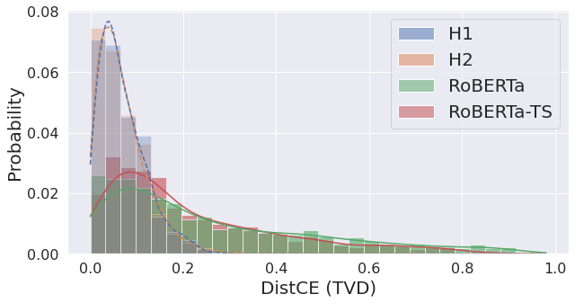

<a href="https://github.com/psf/black"></a>

# Stop Measuring Calibration When Humans Disagree
This repo contains code for our EMNLP 2022 paper [Stop Measuring Calibrations When Humans Disagree](https://arxiv.org/abs/2210.16133).

Please consider citing us if you find this project useful.
```
@inproceedings{baan-etal-2022-stop,
  author={Baan, Joris and Aziz, Wilker and Plank, Barbara and Fernandez, Raquel},
  title={{Stop Measuring Calibration When Humans Disagree}},
  year={2022},
  booktitle={Proceedings of the Conference on Empirical Methods in Natural Language Processing (EMNLP)},
}
```


## Measuring Calibration to Human Uncertainty
The notebook `analysis.ipynb` contains all the code to reproduce the results in the paper. The methods that generate the plots and tables are defined in `analysis_utils.py`.

We implement a couple of metrics (ECE, top-k accuracy, DistCE, EntCE, RankSC) in `calibration_metrics.py` and facilitate loading and stitching ChaosNLI and our predictions in `data_utils.py`.

Run the following commands to quickly reproduce our results:
```shell
conda create -n calibration-disagreement python=3.9
conda activate calibration-disagreement
pip install -r requirements.txt
jupyter notebook analysis.ipynb
```


## Data
We use three datasets for our experiments:
- [SNLI](https://nlp.stanford.edu/projects/snli/): a natural language inference (NLI) dataset with 580k premise-hypothesis pairs labeled as entailment, contradiction, or neutral. The validation set contains 10k examples with 5 annotations each.
- [MNLI](https://cims.nyu.edu/~sbowman/multinli/): similar to SNLI, but with more genres and spoken and written text. 
- [ChaosNLI](https://github.com/easonnie/ChaosNLI): takes roughly 1500 examples from each of the SNLI, MNLI (and AbductiveNLI) development sets for having a borderline annotator agreement, i.e., at most 3 out of 5 human votes for the same class, and gathers an additional 100 annotations for each of the ~4500 instances.

The easiest way to download SNLI and MNLI together is [here](https://github.com/shreydesai/calibration#obtaining-datasets), and ChaosNLI [here](https://github.com/easonnie/ChaosNLI#where-can-i-download-the-data).

Because ChaosNLI is small, we also include it in `/data/chaosnli/chaosNLI_{source_dataset}.jsonl`  

## Training
To fine-tune BERT or RoBERTa on the SNLI or MNLI dataset, we use readily available code from the [Calibration of Pre-trained Transformers (EMNLP 2020) repo](https://github.com/shreydesai/calibration). Please use the format as described below if you want to use your own predictions.

## Predictions
We hope to accelerate future work by providing the model predictions that we use in the paper. You can find them in `data/predictions/{dataset}_{split}_{model_name}_{random_seed}.jsonl`. The jsonl format is as follows:
```json lines
{
  "index": 0,
  "true": 2,
  "pred": 1,
  "conf": 0.6592944264411926,
  "logits": [
    -2.4628310203552246,
    1.3351441621780396,
    0.6306465268135071
  ],
  "probs": [
    0.014778822660446167,
    0.6592944264411926,
    0.3259267210960388
  ],
  "uid": "21155n"
}
```
A few notes:
- We align the class order with chaosNLI in `data_utils.py`
- We include each instance's `uid` in the corresponding prediction json object to safely stitch predictions to ChaosNLI in `data_utils.py`.
- We follow [Desai & Durett (2020)](https://github.com/shreydesai/calibration) who split both the SNLI and MNLI dev set into 5k dev and 5k test sets (-> four 5k splits). Predictions are therefore on one of these splits. ChaosNLI does not split the original dev sets and takes instances from the original 10k dev sets (i.e., from both 5k test and 5k dev splits). If you want to use the entire chaosNLI dataset of, for example, SNLI, make sure to load predictions on both the test and dev set in `analysis.ipynb`